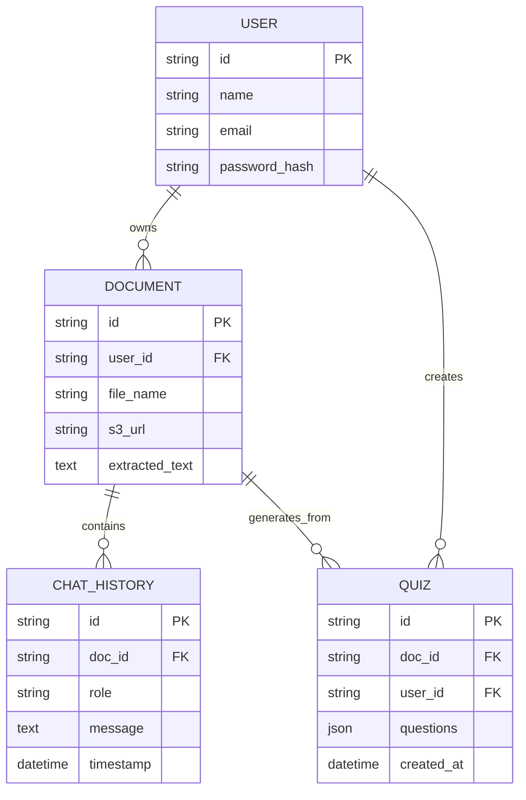

```mermaid
erDiagram
    USER ||--o{ DOCUMENT : owns
    USER ||--o{ QUIZ : creates
    DOCUMENT ||--o{ CHAT_HISTORY : contains
    DOCUMENT ||--o{ QUIZ : generates_from

    USER {
        string id PK
        string name
        string email
        string password_hash
    }

    DOCUMENT {
        string id PK
        string user_id FK
        string file_name
        string s3_url
        text extracted_text
    }

    QUIZ {
        string id PK
        string doc_id FK
        string user_id FK
        json questions
        datetime created_at
    }

    CHAT_HISTORY {
        string id PK
        string doc_id FK
        string role
        text message
        datetime timestamp
    }
```
