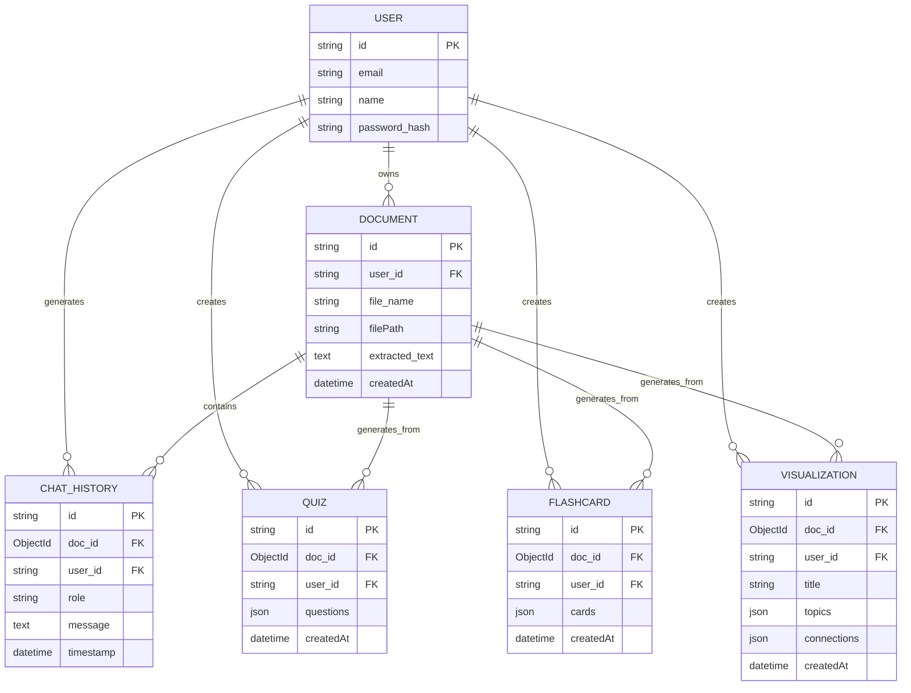

```mermaid
erDiagram
    USER ||--o{ DOCUMENT : owns
    USER ||--o{ QUIZ : creates
    USER ||--o{ FLASHCARD : creates
    USER ||--o{ VISUALIZATION : creates
    USER ||--o{ CHAT_HISTORY : generates
    DOCUMENT ||--o{ CHAT_HISTORY : contains
    DOCUMENT ||--o{ QUIZ : generates_from
    DOCUMENT ||--o{ FLASHCARD : generates_from
    DOCUMENT ||--o{ VISUALIZATION : generates_from

    USER {
        string id PK
        string email
        string name
        string password_hash
    }

    DOCUMENT {
        string id PK
        string user_id FK
        string file_name
        string filePath
        text extracted_text
        datetime createdAt
    }

    QUIZ {
        string id PK
        ObjectId doc_id FK
        string user_id FK
        json questions
        datetime createdAt
    }

    FLASHCARD {
        string id PK
        ObjectId doc_id FK
        string user_id FK
        json cards
        datetime createdAt
    }

    VISUALIZATION {
        string id PK
        ObjectId doc_id FK
        string user_id FK
        string title
        json topics
        json connections
        datetime createdAt
    }

    CHAT_HISTORY {
        string id PK
        ObjectId doc_id FK
        string user_id FK
        string role
        text message
        datetime timestamp
    }
```
