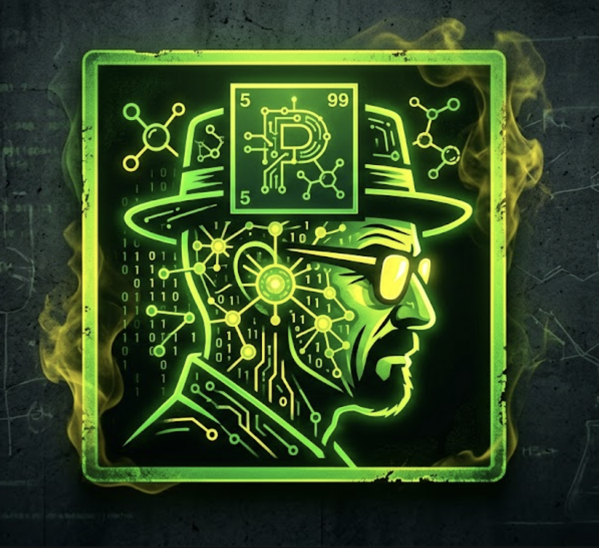
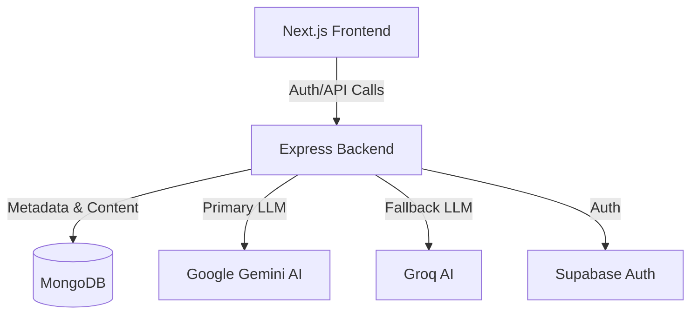

# <p align="center"><br>The Professor</p>

<!-- <p align="center"> -->
  
<!-- </p> -->

<div align="center">

[](https://the-professor-breaking-bad.vercel.app/)
[](https://the-professor.onrender.com)

[](https://nodejs.org/)
[](https://nextjs.org/)
[](https://www.typescriptlang.org/)
[](https://ai.google.dev/)

</div>

---

## Overview

**The Professor** is a cutting-edge full-stack AI application designed to transform static PDF and Office documents into interactive, conversational learning environments. By leveraging state-of-the-art Large Language Models (LLMs), it provides deep document analysis, secure user workspaces, and automated educational assessments.

Inspired by the precision and chemistry of professional systems, this platform ensures that your learning process is as efficient as a well-calibrated laboratory.

## Key Features

| Feature | Description |
| :--- | :--- |
| **Neural Document Analysis** | High-fidelity extraction from PDF/Office files using specialized processing pipelines. |
| **Contextual AI Chat** | Real-time dialogue powered by Gemini 2.0 Flash, grounded strictly in your document's context. |
| **Auto-Quiz Generation** | Intelligent generation of Multiple Choice Questions (MCQs) and flashcards to verify understanding. |
| **Neural Visualization** | Interactive 3D visualization of the AI's internal state using React Three Fiber. |
| **Secure Workspaces** | JWT-based authentication with Supabase integration to persist documents and chat history. |

### Design Documents
- [Use Case Diagram](./useCaseDiagram.md)
- [Sequence Diagram](./sequenceDiagram.md)
- [Class Diagram](./classDiagram.md)
- [ER Diagram](./ErDiagram.md)

## Tech Stack

### Frontend
- **Framework**: [Next.js 15](https://nextjs.org/) 
- **Styling**: [Tailwind CSS](https://tailwindcss.com/) & [Framer Motion](https://www.framer.com/motion/)
- **Visuals**: [React Three Fiber](https://docs.pmnd.rs/react-three-fiber/getting-started/introduction) 
- **State Management**: React Hooks & Axios

### Backend
- **Engine**: [Node.js](https://nodejs.org/) & [Express v5](https://expressjs.com/)
- **Language**: TypeScript
- **Database**: [MongoDB](https://www.mongodb.com/) & [Supabase](https://supabase.com/)

### AI Services
- **LLM**: [Google Gemini 2.0 Flash](https://deepmind.google/technologies/gemini/)
- **Embeddings**: Google Generative AI
- **Parsing**: `pdf-parse` & `officeparser`

---

## System Architecture

The project follows a decoupled Monorepo-style architecture:



---

## Getting Started

### Prerequisites
- Node.js 18+
- MongoDB Instance (or Atlas)
- Google AI SDK Key
- Supabase Account

### Installation

1. **Clone the repository**:
   ```bash
   git clone https://github.com/your-username/the-professor.git
   cd the-professor
   ```

2. **Frontend Setup**:
   ```bash
   cd client
   npm install
   cp .env.example .env.local
   # Fill in your environment variables
   npm run dev
   ```

3. **Backend Setup**:
   ```bash
   cd ../server
   npm install
   cp .env.example .env
   # Fill in your environment variables
   npm run dev
   ```

### Environment Variables

#### Backend (`/server/.env`)
```env
PORT=5001
MONGODB_URI=your_mongodb_uri
GEMINI_API_KEY=your_google_ai_key
SUPABASE_URL=your_supabase_url
SUPABASE_ANON_KEY=your_supabase_key
JWT_SECRET=your_secret
```

#### Frontend (`/client/.env.local`)
```env
NEXT_PUBLIC_API_URL=http://localhost:5001/api
NEXT_PUBLIC_SUPABASE_URL=your_supabase_url
NEXT_PUBLIC_SUPABASE_ANON_KEY=your_supabase_key
```

---

## License

This project is licensed under the ISC License.

---

<p align="center">
  Proudly built for the AI-Driven learning revolution.
</p>
