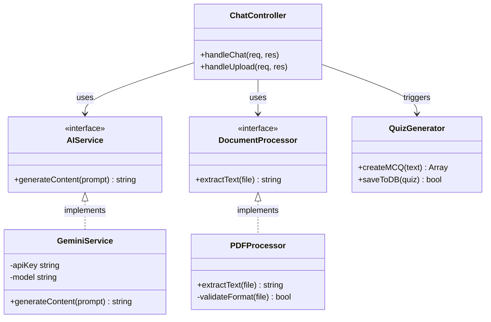

```mermaid
classDiagram
    class DocumentProcessor {
        <<interface>>
        +extractText(file) string
    }

    class PDFProcessor {
        +extractText(file) string
        -validateFormat(file) bool
    }

    class AIService {
        <<interface>>
        +generateContent(prompt) string
    }

    class GeminiService {
        -apiKey string
        -model string
        +generateContent(prompt) string
    }

    class ChatController {
        +handleChat(req, res)
        +handleUpload(req, res)
    }

    class QuizGenerator {
        +createMCQ(text) Array
        +saveToDB(quiz) bool
    }

    DocumentProcessor <|.. PDFProcessor: implements
    AIService <|.. GeminiService: implements
    ChatController --> AIService: uses
    ChatController --> DocumentProcessor: uses
    ChatController --> QuizGenerator: triggers
```
