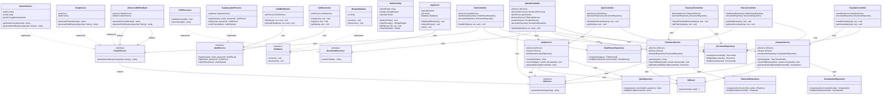

```mermaid
classDiagram
    class AIService {
        <<interface>>
        +generateContent(prompt) string
    }

    class ChatAIService {
        <<interface>>
        +generateChatResponse(prompt, history) string
    }

    class DocumentProcessor {
        <<interface>>
        +extractText(file) string
    }

    class IAuthService {
        <<interface>>
        +register(name, email, password) AuthResult
        +login(email, password) AuthResult
        +verifyToken(token) AuthPayload
    }

    class IDatabase {
        <<interface>>
        +connect() void
        +disconnect() void
    }

    class GeminiService {
        -apiKey string
        -model string
        -gemini GoogleGenerativeAI
        +generateContent(prompt) string
        +generateChatResponse(prompt, history) string
    }

    class GroqService {
        -groq Groq
        -model string
        +generateContent(prompt) string
        +generateChatResponse(prompt, history) string
    }

    class AIServiceWithFallback {
        -primary ChatAIService
        -fallback ChatAIService
        +generateContent(prompt) string
        +generateChatResponse(prompt, history) string
    }

    class PDFProcessor {
        -validateFormat(file) bool
        +extractText(file) string
    }

    class SupabaseAuthService {
        -supabase SupabaseClient
        +register(name, email, password) AuthResult
        +login(email, password) AuthResult
        +verifyToken(token) AuthPayload
    }

    class MongoDatabase {
        -uri string
        +connect() void
        +disconnect() void
    }

    class AppServer {
        +app Application
        -port string
        -database IDatabase
        -initializeMiddlewares() void
        -initializeRoutes() void
        +start() void
    }

    class AuthMiddleware {
        -authService IAuthService
        +handle(req, res, next) void
        +optionalHandle(req, res, next) void
    }

    class MulterConfig {
        -uploadFolder string
        -storage StorageEngine
        +uploader Multer
        -initializeFolder() void
        -createStorage() StorageEngine
        -fileFilter(req, file, cb) void
        -createUploader() Multer
    }

    class AIParser {
        +parseJson(raw, label) T
    }

    class ChatController {
        -aiService ChatAIService
        -chatHistoryRepository ChatHistoryRepository
        -documentRepository DocumentRepository
        +handleChat(req, res, next) void
    }

    class UploadController {
        -aiService AIService
        -documentProcessor DocumentProcessor
        -quizService QuizService
        -flashcardService FlashcardService
        -visualizeService VisualizeService
        -documentRepository DocumentRepository
        +handleUpload(req, res, next) void
    }

    class AuthController {
        -authService IAuthService
        +register(req, res) void
        +login(req, res) void
        +getMe(req, res) void
    }

    class QuizController {
        -quizService QuizService
        -documentRepository DocumentRepository
        +handleQuizGeneration(req, res) void
        +getQuiz(req, res) void
    }

    class FlashcardController {
        -flashcardService FlashcardService
        -documentRepository DocumentRepository
        +handleFlashcardGeneration(req, res) void
        +getFlashcards(req, res) void
    }

    class VisualizeController {
        -visualizeService VisualizeService
        -documentRepository DocumentRepository
        +handleVisualize(req, res) void
        +getVisualization(req, res) void
    }

    class HistoryController {
        -chatHistoryRepository ChatHistoryRepository
        -documentRepository DocumentRepository
        +getChatHistory(req, res) void
        +getUserDocuments(req, res) void
    }

    class QuizService {
        -aiService AIService
        -aiParser AIParser
        -quizRepository QuizRepository
        +createMCQ(text) Array
        +saveToDB(quiz, userId, documentId) bool
        +getQuizByDocId(documentId) Quiz
    }

    class FlashcardService {
        -aiService AIService
        -aiParser AIParser
        -flashcardRepository FlashcardRepository
        +generate(text) Array
        +saveToDB(flashcards, userId, documentId) bool
        +getFlashcardsByDocId(documentId) Flashcard
    }

    class VisualizeService {
        -aiService AIService
        -aiParser AIParser
        -visualizationRepository VisualizationRepository
        +generate(text) TopicVisualization
        +saveToDB(visualization, userId, documentId) bool
        +getVisualizationByDocId(documentId) Visualization
    }

    class DocumentRepository {
        +create(documentData) IDocument
        +findById(documentId) IDocument
        +findByUserId(userId) IDocument[]
    }

    class ChatHistoryRepository {
        +create(messages) IChatHistory[]
        +findByDocId(userId, documentId) IChatHistory[]
    }

    class QuizRepository {
        +create(userId, documentId, questions) IQuiz
        +findByDocId(documentId) IQuiz
    }

    class FlashcardRepository {
        +create(userId, documentId, cards) IFlashcard
        +findByDocId(documentId) IFlashcard
    }

    class VisualizationRepository {
        +create(userId, documentId, data) IVisualization
        +findByDocId(documentId) IVisualization
    }

    ChatAIService --|> AIService: extends
    GeminiService ..|> ChatAIService: implements
    GroqService ..|> ChatAIService: implements
    AIServiceWithFallback ..|> ChatAIService: implements
    PDFProcessor ..|> DocumentProcessor: implements
    SupabaseAuthService ..|> IAuthService: implements
    MongoDatabase ..|> IDatabase: implements

    AIServiceWithFallback --> ChatAIService: primary
    AIServiceWithFallback --> ChatAIService: fallback

    AppServer --> IDatabase: uses

    AuthMiddleware --> IAuthService: uses
    AuthController --> IAuthService: uses

    ChatController --> ChatAIService: uses
    ChatController --> ChatHistoryRepository: uses
    ChatController --> DocumentRepository: uses

    UploadController --> AIService: uses
    UploadController --> DocumentProcessor: uses
    UploadController --> QuizService: uses
    UploadController --> FlashcardService: uses
    UploadController --> VisualizeService: uses
    UploadController --> DocumentRepository: uses

    QuizController --> QuizService: uses
    QuizController --> DocumentRepository: uses
    FlashcardController --> FlashcardService: uses
    FlashcardController --> DocumentRepository: uses
    VisualizeController --> VisualizeService: uses
    VisualizeController --> DocumentRepository: uses
    HistoryController --> ChatHistoryRepository: uses
    HistoryController --> DocumentRepository: uses

    QuizService --> AIService: uses
    QuizService --> AIParser: uses
    QuizService --> QuizRepository: uses
    FlashcardService --> AIService: uses
    FlashcardService --> AIParser: uses
    FlashcardService --> FlashcardRepository: uses
    VisualizeService --> AIService: uses
    VisualizeService --> AIParser: uses
    VisualizeService --> VisualizationRepository: uses
```
