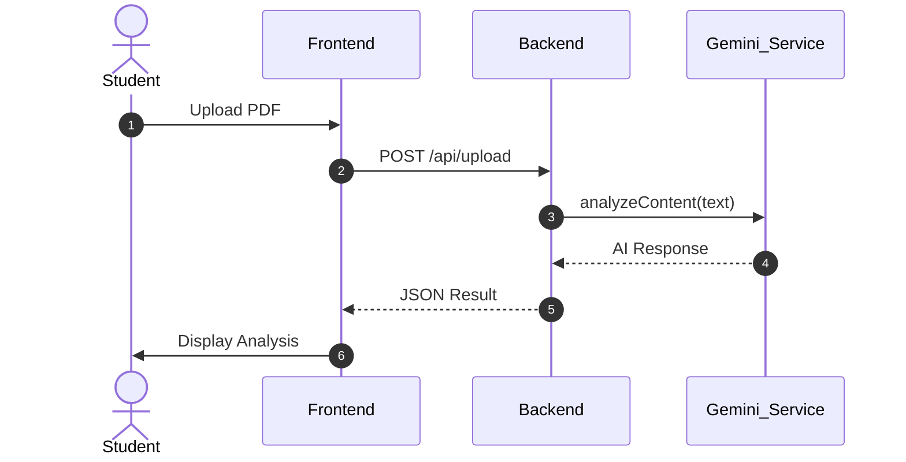
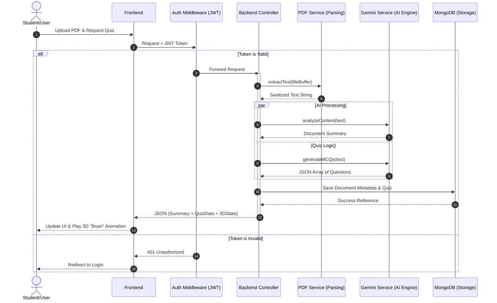

Basic Sequence Diagram

```mermaid 
sequenceDiagram
    autonumber
    actor User as Student
    participant FE as Frontend
    participant BE as Backend
    participant AI as Gemini_Service

    User->>FE: Upload PDF
    FE->>BE: POST /api/upload
    BE->>AI: analyzeContent(text)
    AI-->>BE: AI Response
    BE-->>FE: JSON Result
    FE->>User: Display Analysis
```

Detailed Sequence Diagram

```mermaid
sequenceDiagram
    autonumber
    actor User as Student/User
    participant FE as Frontend 
    participant Auth as Auth Middleware (JWT)
    participant BE as Backend Controller
    participant PDF as PDF Service (Parsing)
    participant AI as Gemini Service (AI Engine)
    participant DB as MongoDB (Storage)

    User->>FE: Upload PDF & Request Quiz
    FE->>Auth: Request + JWT Token
    
    alt Token is Valid
        Auth->>BE: Forward Request
        activate BE
        BE->>PDF: extractText(fileBuffer)
        PDF-->>BE: Sanitized Text String
        
        par AI Processing
            BE->>AI: analyzeContent(text)
            AI-->>BE: Document Summary
        and Quiz Logic
            BE->>AI: generateMCQs(text)
            AI-->>BE: JSON Array of Questions
        end

        BE->>DB: Save Document Metadata & Quiz
        DB-->>BE: Success Reference
        
        BE-->>FE: JSON (Summary + QuizData + 3DState)
        deactivate BE
        FE-->>User: Update UI & Play 3D "Brain" Animation
    else Token is Invalid
        Auth-->>FE: 401 Unauthorized
        FE-->>User: Redirect to Login
    end
```
