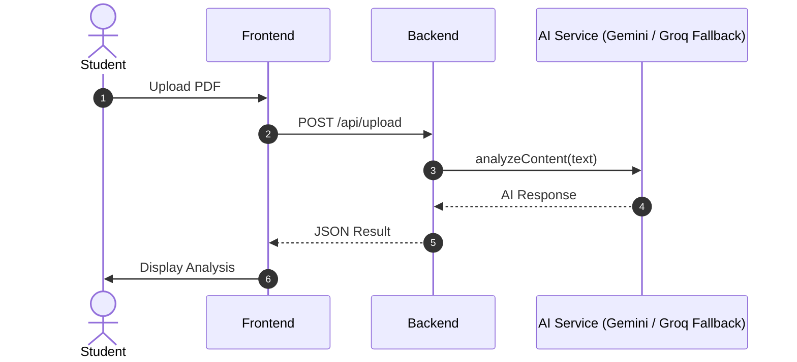
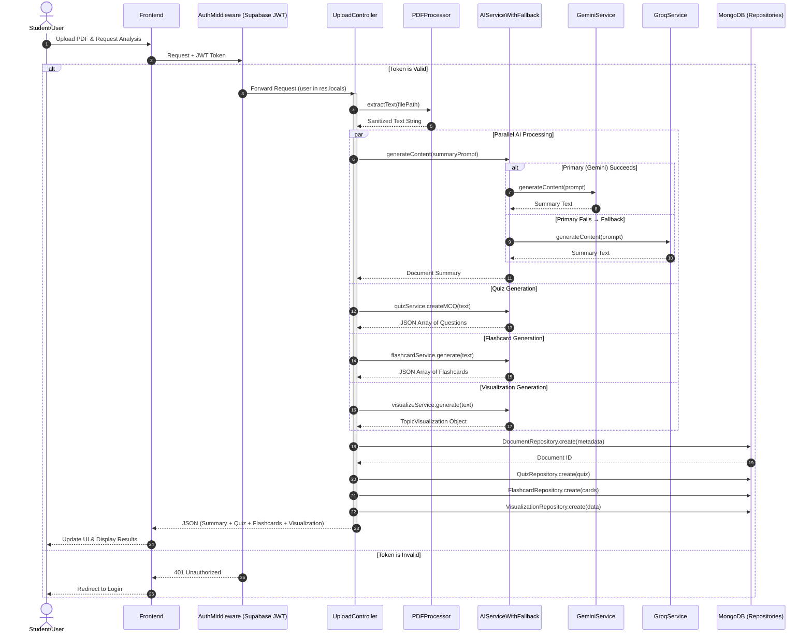
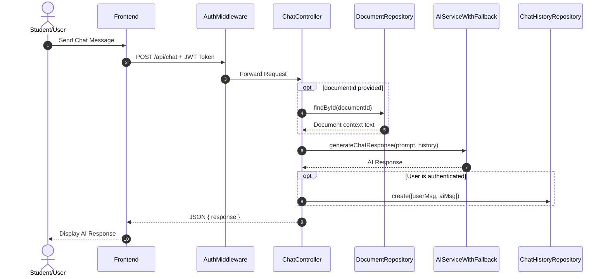

Basic Sequence Diagram

```mermaid
sequenceDiagram
    autonumber
    actor User as Student
    participant FE as Frontend
    participant BE as Backend
    participant AI as AI Service (Gemini / Groq Fallback)

    User->>FE: Upload PDF
    FE->>BE: POST /api/upload
    BE->>AI: analyzeContent(text)
    AI-->>BE: AI Response
    BE-->>FE: JSON Result
    FE->>User: Display Analysis
```

Detailed Upload Sequence Diagram

```mermaid
sequenceDiagram
    autonumber
    actor User as Student/User
    participant FE as Frontend
    participant Auth as AuthMiddleware (Supabase JWT)
    participant BE as UploadController
    participant PDF as PDFProcessor
    participant AI as AIServiceWithFallback
    participant Gemini as GeminiService
    participant Groq as GroqService
    participant DB as MongoDB (Repositories)

    User->>FE: Upload PDF & Request Analysis
    FE->>Auth: Request + JWT Token
    
    alt Token is Valid
        Auth->>BE: Forward Request (user in res.locals)
        activate BE
        BE->>PDF: extractText(filePath)
        PDF-->>BE: Sanitized Text String
        
        par Parallel AI Processing
            BE->>AI: generateContent(summaryPrompt)
            alt Primary (Gemini) Succeeds
                AI->>Gemini: generateContent(prompt)
                Gemini-->>AI: Summary Text
            else Primary Fails → Fallback
                AI->>Groq: generateContent(prompt)
                Groq-->>AI: Summary Text
            end
            AI-->>BE: Document Summary
        and Quiz Generation
            BE->>AI: quizService.createMCQ(text)
            AI-->>BE: JSON Array of Questions
        and Flashcard Generation
            BE->>AI: flashcardService.generate(text)
            AI-->>BE: JSON Array of Flashcards
        and Visualization Generation
            BE->>AI: visualizeService.generate(text)
            AI-->>BE: TopicVisualization Object
        end

        BE->>DB: DocumentRepository.create(metadata)
        DB-->>BE: Document ID
        BE->>DB: QuizRepository.create(quiz)
        BE->>DB: FlashcardRepository.create(cards)
        BE->>DB: VisualizationRepository.create(data)
        
        BE-->>FE: JSON (Summary + Quiz + Flashcards + Visualization)
        deactivate BE
        FE-->>User: Update UI & Display Results
    else Token is Invalid
        Auth-->>FE: 401 Unauthorized
        FE-->>User: Redirect to Login
    end
```

Chat Sequence Diagram

```mermaid
sequenceDiagram
    autonumber
    actor User as Student/User
    participant FE as Frontend
    participant Auth as AuthMiddleware
    participant Chat as ChatController
    participant DocRepo as DocumentRepository
    participant AI as AIServiceWithFallback
    participant HistRepo as ChatHistoryRepository

    User->>FE: Send Chat Message
    FE->>Auth: POST /api/chat + JWT Token
    Auth->>Chat: Forward Request

    opt documentId provided
        Chat->>DocRepo: findById(documentId)
        DocRepo-->>Chat: Document context text
    end

    Chat->>AI: generateChatResponse(prompt, history)
    AI-->>Chat: AI Response

    opt User is authenticated
        Chat->>HistRepo: create([userMsg, aiMsg])
    end

    Chat-->>FE: JSON { response }
    FE-->>User: Display AI Response
```
