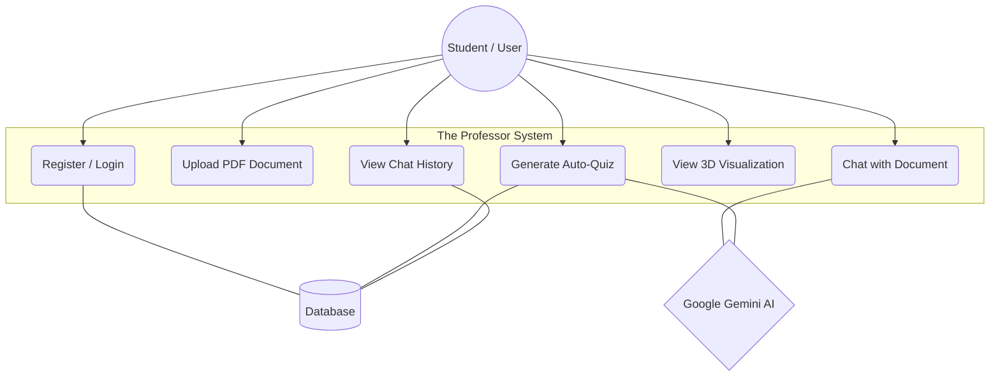

```mermaid 
graph TD
    %% Define Actors with unique shapes
    User((Student / User))
    Gemini{Google Gemini AI}
    DB[(Database)]

    %% Define the System Boundary
    subgraph The_Professor_System [The Professor System]
        UC1(Register / Login)
        UC2(Upload PDF Document)
        UC3(Chat with Document)
        UC4(Generate Auto-Quiz)
        UC5(View 3D Visualization)
        UC6(View Chat History)
    end

    %% User Interactions
    User --> UC1
    User --> UC2
    User --> UC3
    User --> UC4
    User --> UC5
    User --> UC6

    %% System Dependencies
    UC1 --- DB
    UC3 --- Gemini
    UC4 --- Gemini
    UC4 --- DB
    UC6 --- DB
```
