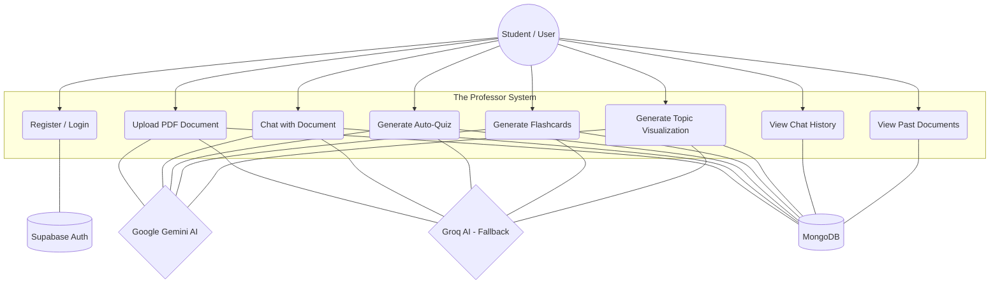

```mermaid
graph TD
    %% Define Actors with unique shapes
    User((Student / User))
    Gemini{Google Gemini AI}
    Groq{Groq AI - Fallback}
    DB[(MongoDB)]
    Supabase[(Supabase Auth)]

    %% Define the System Boundary
    subgraph The_Professor_System [The Professor System]
        UC1(Register / Login)
        UC2(Upload PDF Document)
        UC3(Chat with Document)
        UC4(Generate Auto-Quiz)
        UC5(Generate Flashcards)
        UC6(Generate Topic Visualization)
        UC7(View Chat History)
        UC8(View Past Documents)
    end

    %% User Interactions
    User --> UC1
    User --> UC2
    User --> UC3
    User --> UC4
    User --> UC5
    User --> UC6
    User --> UC7
    User --> UC8

    %% System Dependencies
    UC1 --- Supabase
    UC2 --- Gemini
    UC2 --- Groq
    UC2 --- DB
    UC3 --- Gemini
    UC3 --- Groq
    UC3 --- DB
    UC4 --- Gemini
    UC4 --- Groq
    UC4 --- DB
    UC5 --- Gemini
    UC5 --- Groq
    UC5 --- DB
    UC6 --- Gemini
    UC6 --- Groq
    UC6 --- DB
    UC7 --- DB
    UC8 --- DB
```
